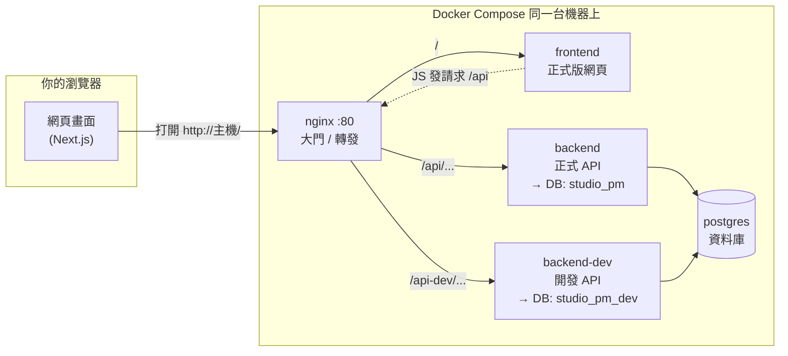

# Studio PM — 3D 動畫工作室專案管理系統

> **這份 README 給誰看？**  
> 你懂程式邏輯，但不一定熟悉「伺服器、Docker、前後端怎麼連、資料存在哪」。  
> 以後就算換了 AI 助手或沒人在旁邊，只要照這裡的**概念圖 + 指令表**，就能繼續改程式、看畫面、備份資料。

---

## 目錄

1. [先記住三件事](#先記住三件事)
2. [系統長什麼樣（誰跟誰說話）](#系統長什麼樣誰跟誰說話)
3. [程式碼、映像檔、資料庫 — 三種東西不要混在一起](#程式碼映像檔資料庫--三種東西不要混在一起)
4. [Docker Compose 在做什麼](#docker-compose-在做什麼)
5. [開發版 vs 正式版（兩套資料、兩個入口）](#開發版-vs-正式版兩套資料兩個入口)
6. [日常操作手冊（改完程式怎麼看到效果）](#日常操作手冊改完程式怎麼看到效果)
7. [指令速查表](#指令速查表)
8. [改資料表結構（migration）](#改資料表結構migration)
9. [備份、還原、跟 NAS 的關係](#備份還原跟-nas-的關係)
10. [用 Cursor / Agent / Skills 繼續開發](#用-cursor--agent--skills-繼續開發)
11. [第一次部署（TrueNAS / 本機）](#第一次部署truenas--本機)
12. [常見問題](#常見問題)
13. [API 一覽](#api-一覽)

---

## 先記住三件事

| 東西 | 在哪裡 | 會不會因為 `docker compose build` 而變？ |
|------|--------|----------------------------------------|
| **程式碼** | 你電腦 / NAS 上的 `PMer/` 資料夾（git 管理） | 不會；build 只是**讀**程式碼去打包 |
| **映像檔（Image）** | Docker 內建的「已打包好的程式快照」 | **會**在 build 時重新產生 |
| **資料（DB、上傳檔）** | PostgreSQL volume、`uploads` volume（或你綁到 NAS 的目錄） | **不會**自動寫回 `schema.sql`；要備份請用 dump / 複製 volume |

**重要：** `build` 完之後，**資料庫裡的資料不會自動回到程式碼**。  
方向是：**程式改完 → build 映像 → 容器跑新程式，但 DB 還是舊資料**。  
若改了表結構，要另外跑 **migration SQL**（見下文）。

---

## 系統長什麼樣（誰跟誰說話）

你可以把整個系統想成：**瀏覽器只跟「大門」nginx 說話**，nginx 再轉給前端或後端；後端才跟資料庫說話。



### 一次點「儲存專案」時發生什麼事（簡化）

1. 瀏覽器裡的 React 頁面呼叫 `fetch('/api/projects/...')`（程式在 `frontend/lib/api.js`）。
2. 請求送到 **nginx**（因為網址是 `http://你的主機/api/...`）。
3. nginx 依路徑轉到 **backend** 容器裡的 Express（`backend/src/server.js`）。
4. Express 用 **pg** 連線字串連 **postgres**，執行 SQL，回 JSON。
5. 前端收到 JSON，畫面更新。

**你不需要會設定防火牆：** 在 Docker 內部，容器用**服務名稱**當主機名（例如 `DB_HOST=postgres`），那是 Docker 內建 DNS，跟區網 IP 無關。

### 資料夾對應（改功能時找哪裡）

| 資料夾 | 技術 | 負責什麼 |
|--------|------|----------|
| `frontend/` | Next.js + React | 畫面、Gantt、表單 |
| `backend/src/routes/` | Express | REST API 一條路由一個檔 |
| `backend/src/db/schema.sql` | PostgreSQL | **全新安裝**時的表結構範本 |
| `backend/src/db/migrations/*.sql` | PostgreSQL | **已經在跑的 DB** 要補欄位時用 |
| `nginx.conf` | nginx | `/` → 前端、`/api` → 後端 |
| `docker-compose.yml` | Docker | 有哪些容器、環境變數、volume |
| `seeds/seed.sql` | SQL | 第一次建庫的示範資料 |

---

## 程式碼、映像檔、資料庫 — 三種東西不要混在一起

```
  [ Git 程式碼 ]  --build-->  [ Docker 映像 ]  --run-->  [ 容器在跑 ]
                                    |
                                    +--> 讀寫 -->  [ postgres volume ]
                                    +--> 讀寫 -->  [ uploads volume ]
```

- **改 `.jsx` / `.js`**：改的是程式碼；要讓「正式網站 :80」看到，通常要 `build frontend` 再 `up`（見下節）。
- **在網頁上新增專案、上傳檔案**：改的是 **資料庫 / uploads**，不會出現在 git 裡。
- **想把 DB 結構同步進 repo**：要手動把 migration 寫進 `migrations/`，並在現有 DB 上執行；**不會**從容器自動 export 回 `schema.sql`（除非你刻意做 dump）。

---

## Docker Compose 在做什麼

**一句話：** 讀 `docker-compose.yml`，一次啟動好「資料庫 + 後端 + 前端 + nginx」好幾個容器，並幫它們接好網路與硬碟。

| 指令 | 意思 |
|------|------|
| `docker compose up -d` | 用**現有映像**在背景啟動全部服務 |
| `docker compose build <服務名>` | 依 Dockerfile **重新打包**該服務的映像 |
| `docker compose up -d <服務名>` | 用新映像**重建**該容器 |
| `docker compose ps` | 看哪些容器在跑 |
| `docker compose logs -f backend` | 看後端 log（除錯用） |
| `docker compose exec postgres psql -U studio -d studio_pm` | 進資料庫下 SQL |

### 本專案有哪些容器

| Compose 服務名 | 容器名稱 | 用途 |
|----------------|----------|------|
| `postgres` | `studio-pm-db` | PostgreSQL，裡面可有 `studio_pm` + `studio_pm_dev` 兩個庫 |
| `backend` | `studio-pm-api` | 正式 API → `studio_pm` |
| `backend-dev` | `studio-pm-api-dev` | 開發 API → `studio_pm_dev` |
| `frontend` | `studio-pm-web` | 正式前端（已 `npm run build` 打包進映像） |
| `frontend-dev` | `studio-pm-web-dev` | 開發前端（**profile: dev**，掛載原始碼，熱更新） |
| `nginx` | `studio-pm-nginx` | 對外 **port 80**，統一入口 |

第一次建立 `postgres` 容器時，會自動執行：

- `backend/src/db/schema.sql`（建表）
- `seeds/seed.sql`（示範資料）

**之後重啟 postgres 不會再跑這兩個檔**（資料已在 volume 裡了）。

---

## 開發版 vs 正式版（兩套資料、兩個入口）

| | **正式（給日常使用）** | **開發（給改程式試用）** |
|--|------------------------|---------------------------|
| 網址 | `http://<主機>/`（port **80**） | `http://<主機>:3000/`（需 `profile dev`） |
| 前端 | 容器 `frontend`（映像內建 build 結果） | `frontend-dev`（掛 `./frontend`，存檔即熱更新） |
| API 路徑 | `/api/...` | 瀏覽器在 :3000 時通常連 `http://127.0.0.1:3001/api`；或用 `/api-dev` 連 dev 庫 |
| 後端容器 | `backend` | `backend-dev`（改後端要 rebuild 這個） |
| 資料庫 | `studio_pm` | `studio_pm_dev` |
| 資料會互相影響嗎？ | — | **不會**（不同 DB）；但 **uploads volume 兩邊共用**，在 dev 刪檔可能影響正式路徑 |

### 什麼時候用哪一個？

- **改 UI、試功能、不怕弄壞資料** → 優先 `:3000` + `backend-dev` / `studio_pm_dev`。
- **確認要交給同事看的版本** → 改完後 `build frontend` + `up`，用 **:80** 看。
- **要把正式資料複製到 dev 試** → `./scripts/clone-db-to-dev.sh`（會整庫覆蓋 dev）。

啟動開發用前端（可選）：

```bash
docker compose --profile dev up -d frontend-dev
```

`.env` 若從**別台電腦**開 `:3000`，要設（改成你的 VM IP）：

```env
DEV_NEXT_PUBLIC_API_URL=http://192.168.x.x/api-dev
```

---

## 日常操作手冊（改完程式怎麼看到效果）

**一律在專案根目錄**（有 `docker-compose.yml` 的那一層）下指令。

### 我只改了前端 `frontend/`

| 你怎麼看畫面 | 要做的事 |
|--------------|----------|
| `http://localhost:3000`（frontend-dev） | 通常**不用 build**；瀏覽器 **Ctrl+Shift+R** 強制重新整理 |
| `http://localhost` port **80**（正式） | `docker compose build frontend && docker compose up -d frontend nginx` |

### 我只改了後端 `backend/`

| API 連到哪 | 要做的事 |
|------------|----------|
| 開發 API（`backend-dev` / `studio_pm_dev`） | `docker compose build backend-dev && docker compose up -d backend-dev` |
| 正式 API（`backend` / `studio_pm`） | `docker compose build backend && docker compose up -d backend` |

### 我改了資料庫結構（新增欄位、新表）

1. 新增 `backend/src/db/migrations/YYYYMMDD_說明.sql`。
2. 更新 `backend/src/db/schema.sql`（給**以後全新安裝**用）。
3. 在**已存在的** DB 上執行 migration，例如：

```bash
docker compose exec -T postgres psql -U studio -d studio_pm_dev \
  -f - < backend/src/db/migrations/20260217_milestone_detail_nodes.sql
```

（正式庫把 `studio_pm_dev` 改成 `studio_pm`，執行前建議先備份。）

### 改完想確認服務有起來

```bash
docker compose ps
curl -s http://localhost/api/health
curl -s http://localhost/api-dev/health
```

### Git（保存程式碼變更）

```bash
git status
git add -A
git commit -m "說明這次改了什麼"
git push   # 若要同步到 GitHub / 遠端
```

**Git 只管程式碼，不管資料庫裡的專案資料。**

---

## 指令速查表

```bash
# --- 環境 ---
cp .env.example .env          # 第一次；再編輯密碼、PORT 等

# --- 啟動 / 停止 ---
docker compose up -d            # 啟動預設服務（含 dev 後端，不含 frontend-dev）
docker compose down             # 停止（volume 資料通常還在）
docker compose ps
docker compose logs -f nginx

# --- 建映像 + 換新容器（見上節「日常操作」）---
docker compose build frontend && docker compose up -d frontend nginx
docker compose build backend-dev && docker compose up -d backend-dev

# --- 資料庫 ---
docker compose exec postgres psql -U studio -d studio_pm
./scripts/clone-db-to-dev.sh    # 正式庫 → 複製到 dev 庫

# --- 本機不用 Docker 跑前後端（進階，可選）---
npm run install:all
npm run dev:api                 # 後端 :3001，需 postgres 已 up
npm run dev:web                 # 前端 :3000
```

---

## 改資料表結構（migration）

專案**沒有**全自動 migration 框架；慣例是：

1. 在 `backend/src/db/migrations/` 放 SQL 檔。
2. 手動對 `studio_pm` / `studio_pm_dev` 各執行一次（或寫腳本）。
3. 部分功能有 npm 腳本，例如：`npm run db:migrate:milestones`（在 repo 根目錄）。

**全新安裝**只會跑 `schema.sql` + `seed.sql`，不會自動跑 `migrations/` 裡舊檔；新環境若需要完整結構，應把 migration 內容合併進 `schema.sql`，或寫一支「依序套用所有 migration」的腳本。

---

## 備份、還原、跟 NAS 的關係

### 資料實際存在哪

預設在 Docker **named volume**（名字像 `pmer_postgres_data`），不在你的 `PMer/` 原始碼裡。

若部署在 **TrueNAS**，建議把 volume **bind mount** 到 NAS 資料集（程式碼裡有範例路徑）：

```yaml
# docker-compose.yml 範例（需依你的 pool 路徑修改）
postgres_data:
  driver: local
  driver_opts:
    type: none
    o: bind
    device: /mnt/tank/studio-pm/postgres
```

這樣：

- **PostgreSQL 檔案**在 NAS 磁碟上 → TrueNAS **快照 / replication** 可以當基礎設施備份。
- **上傳檔**同理，綁到 `/mnt/tank/studio-pm/uploads`。

**本 repo 沒有內建「自動上傳到 NAS」的腳本**；「備份到 NAS」通常是：

1. 資料本來就放在 NAS bind mount；或  
2. 你用下面指令產生 `.sql` 檔，再**手動複製**到 NAS 共用資料夾；或  
3. 在 TrueNAS 排程任務跑 `pg_dump`（需在 NAS 上能執行 `docker exec`）。

### 手動備份資料庫（建議定期做）

在專案根目錄：

```bash
# 備份正式庫
docker compose exec -T postgres pg_dump -U studio --no-owner studio_pm \
  > "backup_studio_pm_$(date +%Y%m%d_%H%M).sql"

# 備份開發庫（可選）
docker compose exec -T postgres pg_dump -U studio --no-owner studio_pm_dev \
  > "backup_studio_pm_dev_$(date +%Y%m%d_%H%M).sql"
```

把產生的 `.sql` 複製到 NAS（例如 SMB 掛載的 `\\nas\backup\studio-pm\`）即可。

### 還原（會覆蓋目標庫內容，請先備份）

```bash
docker compose exec -T postgres psql -U studio -d studio_pm < backup_studio_pm_20260516.sql
```

### uploads（合約附件等）

```bash
# 查看 volume 實際掛載點（記下 Mountpoint）
docker volume inspect pmer_uploads_data

# 或直接打包（路徑依環境而異）
docker run --rm -v pmer_uploads_data:/data -v $(pwd):/backup alpine \
  tar czf /backup/uploads_backup_$(date +%Y%m%d).tar.gz -C /data .
```

---

## 用 Cursor / Agent / Skills 繼續開發

### Cursor Agent（對話裡的 AI）

- 在 Cursor 開啟 **`PMer` 資料夾** 當 workspace。
- 直接說需求，例如：「排程頁 Gantt tooltip 要跟滑鼠」、「加 milestone 欄位」。
- Agent 會改檔案、跑終端機；你可用本 README 的 **「日常操作」** 檢查它有没有 `build` / `up`。

### 專案規則（會自動套用）

路徑：`.cursor/rules/docker-rebuild-workflow.mdc`  

內容摘要：**改 frontend 且要看 :80 → build frontend；改 backend-dev → build backend-dev**。  
你若發現畫面沒更新，可以貼這段規則給 Agent：「我現在看的是 port 80 / 3000？」

### Skills（技能包）

| 位置 | 誰能用 | 說明 |
|------|--------|------|
| `PMer/.agents/skills/` | 此專案 | 例如 `web-design-guidelines`（UI 審查） |
| `~/.cursor/skills-cursor/` | 全 Cursor | 建立 rule、PR、設定等 |
| `~/.agents/skills/` | 使用者全域 | 例如 `find-skills` |

**你怎麼「使用」skill？**  
不用手動執行檔案。在 Cursor 對話裡描述任務即可；符合描述時 Agent 會**自動讀取**對應的 `SKILL.md`。  
若要加專案專用流程，可在 `.agents/skills/你的技能名/SKILL.md` 新增（可參考 `create-skill` 全域技能）。

### 和 AI 協作時建議怎麼講

- 說清楚你看的網址：`http://IP/`（80）還是 `:3000`。
- 說要不要動正式庫：「只改 dev DB」或「正式也要 migration」。
- 做完請它：`build + up` 或你自己跑速查表指令。

---

## 第一次部署（TrueNAS / 本機）

### 1. 設定環境變數

```bash
cp .env.example .env
```

編輯 `.env`（至少改 `DB_PASSWORD`）。  
Docker + nginx 部署時建議：

```env
NEXT_PUBLIC_API_URL=/api
PORT=80
```

### 2. 啟動

```bash
docker compose up -d
```

### 3. 建立 dev 資料庫（第一次，可選）

```bash
./scripts/clone-db-to-dev.sh
```

### 4. 開發用熱更新前端（可選）

```bash
docker compose --profile dev up -d frontend-dev
```

瀏覽器：`http://<你的主機 IP>/`（正式）、`http://<IP>:3000/`（開發）。

---

## 常見問題

**Q：我改了程式，網頁還是舊的？**  
- 先確認是 **:3000** 還是 **:80**。  
- :80 一定要 `build frontend` + `up`。  
- 瀏覽器強制重新整理或無痕視窗。

**Q：`build` 會不會把我的資料庫清空？**  
- 不會。除非你用 `docker compose down -v`（**`-v` 會刪 volume，危險**）。

**Q：seed 示範資料想重來？**  
- 需刪 postgres volume 再 `up`（等於清空 DB），或手動 drop database。生產環境勿隨意做。

**Q：正式與 dev API 怎麼分？**  
- nginx：`/api` → `backend` → `studio_pm`；`/api-dev` → `backend-dev` → `studio_pm_dev`。

**Q：port 3001 / 5432 被占用？**  
- 見 `.env.example` 的 `POSTGRES_PUBLISH_PORT`、`frontend/.env.development.local.example`、`npm run dev:api:3110`。

---

## API 一覽

| Method | Endpoint | 說明 |
|--------|----------|------|
| GET | /api/projects | 所有專案 |
| POST | /api/projects | 建立專案 |
| PUT | /api/projects/:id | 更新專案 |
| DELETE | /api/projects/:id | 刪除專案 |
| GET | /api/tasks?project_id= | 任務列表 |
| POST | /api/tasks | 建立任務 |
| GET | /api/team-members | 成員列表 |
| POST | /api/time-allocations | 指派成員到任務 |
| POST | /api/time-allocations/check-conflicts | 衝突偵測 |
| GET | /api/project-milestones | 專案里程碑 |
| GET | /api/contracts | 合約列表 |
| GET | /api/invoices | 發票列表 |
| POST | /api/invoices/generate | 自動計費預覽 |
| GET | /api/invoices/:id/pdf | 下載 PDF |
| GET | /api/health | 健康檢查 |

---

## 技術架構（給查資料用）

```
frontend/   Next.js 15 + Tailwind（畫面）
backend/    Node.js + Express + PostgreSQL（API）
nginx/      反向代理（對外 port 80）
postgres/   PostgreSQL 16（Docker 官方映像）
```

種子資料（僅**第一次** init DB）：客戶、專案、成員、分配、合約、發票等示範列 — 見 `seeds/seed.sql`。

---

## 功能特色（產品面）

- **Dashboard** — 專案、成員、發票總覽；工作室 Gantt
- **專案管理** — 客戶、合約、里程碑時程
- **Gantt** — 成員／專案時間軸、拖拉、衝突偵測
- **合約 / 發票** — 附件、PDF 匯出
- **成員** — 時薪、角色、工時分配

---

*若你更新了部署方式（例如 NAS 實際備份排程路徑），建議在本檔「備份」一節補上你的 IP、路徑、排程頻率，未來的自己會感謝你。*
